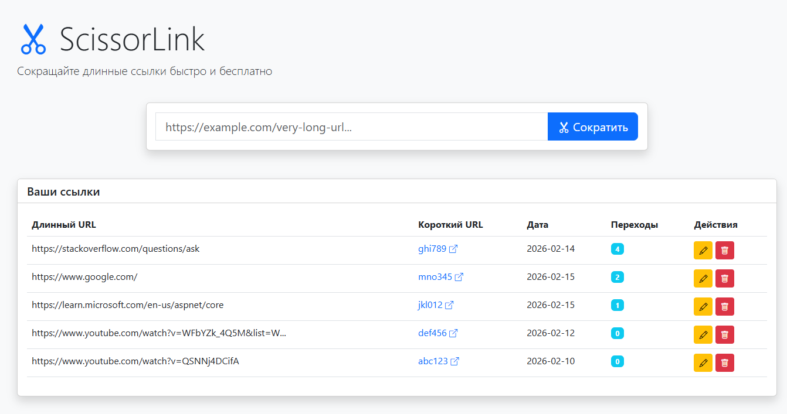

# ✂️ ScissorLink

A modern, high-performance URL shortener built with .NET 10 and Three-layer architecture principles.

## Features

- **URL Shortening** — Convert long URLs into compact, shareable links using SHA256-based code generation
- **Redirect Service** — Fast redirection from short codes to original URLs
- **Click Tracking** — Track the number of times each shortened link is accessed
- **Full CRUD Operations** — Create, read, update, and delete shortened URLs
- **HATEOAS Support** — RESTful API responses include hypermedia links for discoverability
- **Interactive API Docs** — Built-in Scalar UI for exploring and testing the API
- **Web Interface** — Simple static web UI for quick URL shortening





## Tech Stack

| Layer | Technology |
|-------|-------|
| Runtime | .NET 10.0, C# 14 |
| Web Framework | ASP.NET Core Web API |
| ORM | Entity Framework Core 9.0 |
| Database | MariaDB 11.4 |
| API Documentation | OpenAPI + Scalar |
| Testing | xUnit |
| Containerization | Docker, Docker Compose |

## Architecture

The project follows **Three-layer architecture** with layer separation:

```
src/
├── ScissorLink.API           # Presentation layer
│   ├── Controllers/          # API endpoints
│   ├── Dtos/                 # Request/Response models
│   └── ConfigurationExtensions/
├── ScissorLink.BLL           # Business Logic layer
│   ├── Services/             # Business logic implementation
│   └── Interfaces/           # Service contracts
└── ScissorLink.DAL.MariaDB   # Data Access layer
    ├── Models/               # Database entities
    ├── Repositories/         # Data access implementation
    ├── Configurations/       # EF Core configurations
    └── Migrations/           # Database migrations
```

## Getting Started

### Prerequisites

- [.NET 10 SDK](https://dotnet.microsoft.com/download)
- [Docker](https://www.docker.com/get-started) (for database)


### Running the Application

```bash
cd docker
cp .env.example .env  # Configure your credentials
docker compose up -d --build
```

The API Documentation will be available at `https://localhost:7373/scalar` 
(and frontend `http://localhost:7373/index.html`).

## API Endpoints

| Method | Endpoint | Description |
|--------|----------|-------------|
| `GET` | `/api/urls` | Get all URLs |
| `GET` | `/api/urls/{id}` | Get URL by ID |
| `POST` | `/api/urls` | Create shortened URL |
| `PUT` | `/api/urls/{id}` | Update URL |
| `DELETE` | `/api/urls/{id}` | Delete URL |
| `GET` | `/go/{shortCode}` | Redirect to original URL |

## Possible Improvements

If you'd like to contribute or extend this project, here are some ideas:

- [ ] **Redis Caching** — Cache frequently accessed URLs for faster redirects
- [ ] **User Authentication** — Add user accounts to manage personal URL collections
- [ ] **Custom Short Codes** — Allow users to specify their own short codes
- [ ] **URL Expiration** — Set TTL for temporary links
- [ ] **Rate Limiting** — Prevent abuse with request throttling
- [ ] **Analytics Dashboard** — Visualize click statistics, geographic data, referrers
- [ ] **Health Checks** — Add endpoints for monitoring and load balancers

## Contributing

Contributions are welcome! Feel free to open issues or submit pull requests.